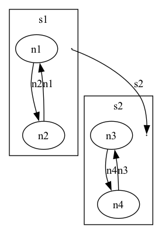
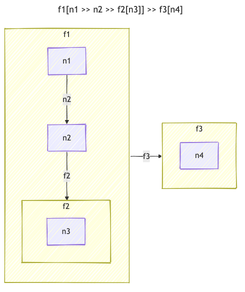

<div align="center">
  <h1>agnflow</h1>
  <strong>A concise Python workflow agentic engine</strong>
  <br>
  <p>
    <a href="LICENSE"></a>
    <a href="https://jianduo1.github.io/agnflow/"></a>
    <a href="https://pypi.org/project/agnflow/"></a>
    <a href="https://www.python.org/downloads/"></a>
  </p>
</div>

[中文](README.md) | English 

**agnflow** pursues simplicity, ease of use, and extensibility, suitable for rapid prototyping, customized LLM workflows, and Agent task flows.

## 1. TODO (Future Extension Directions)

- [ ] llm (supporting stream, multimodal, async, structured output)
- [ ] memory
- [ ] rag
- [ ] mcp tool
- [ ] ReAct (reasoning + action)
- [ ] TAO (thought + action + observation)
- [ ] ToT (Tree of Thought)
- [ ] CoT (Chain of Thought)
- [ ] hitl (human in the loop)
- [ ] supervisor swarm

> The above are future extensible intelligent agent/reasoning/tool integration directions. Contributions and suggestions are welcome.

## 2. Features
- Node-based workflows with support for branching, loops, and sub-flows
- Support for synchronous and asynchronous execution
- Support for flowchart rendering (dot/mermaid)
- Clean code, easy to extend

## 3. Installation

### 3.1 Install from PyPI (Recommended)

```bash
# Install using pip
pip install agnflow

# Install using rye
rye add agnflow

# Install using poetry
poetry add agnflow

# Install specific version
pip install agnflow==0.1.0

# Install latest development version
pip install --upgrade agnflow
```

### 3.2 Install from Source

Recommended to use [rye](https://rye-up.com/) for dependency and virtual environment management:

```bash
# Clone repository
git clone https://github.com/jianduo1/agnflow.git
cd agnflow

# Install dependencies
rye sync

# Development mode installation
rye sync --dev
```

### 3.3 Development Environment

Use rye to manage development environment:

```bash
# Install dependencies
rye sync

# Run tests
rye run test

# Code formatting
rye run format

# Code linting
rye run lint

# Run examples
rye run example
```

### 3.4 Publish to PyPI

```bash
# Clean previous builds
rye run clean

# Build package
rye run build

# Upload to test PyPI (recommended to test first)
rye run upload-test

# Upload to official PyPI
rye run upload
```

**Note:** First upload to PyPI requires:
1. Register account on [PyPI](https://pypi.org)
2. Register account on [TestPyPI](https://test.pypi.org)
3. Configure `~/.pypirc` file or use environment variables

### 3.5 Flowchart Rendering Tools (Optional)

**Note: Generating images requires additional tools**

**Dot format image generation (Recommended):**
```bash
# macOS
brew install graphviz

# Ubuntu/Debian
sudo apt-get install graphviz

# CentOS/RHEL
sudo yum install graphviz

# Windows
# Download and install: https://graphviz.org/download/
```

**Mermaid format image generation:**
```bash
# Install mermaid-cli
npm install -g @mermaid-js/mermaid-cli

# Install puppeteer browser (for rendering)
npx puppeteer browsers install chrome-headless-shell
```

## 4. Quick Start

### 4.1 Define Nodes
```python
from agnflow import Node, Flow

def hello_exec(state):
    print("hello", state)
    return {"msg": "world"}

def world_exec(state):
    print("world", state)

n1 = Node("hello", exec=hello_exec)
n2 = Node("world", exec=world_exec)
n1 >> n2
```

### 4.2 Build and Run Workflow
```python
flow = Flow(n1, name="demo")
flow.run({"msg": "hi"})
```

### 4.3 Asynchronous Execution
```python
import asyncio
async def ahello(state):
    print("async hello", state)
    return {"msg": "async world"}
n1 = Node("hello", aexec=ahello)
flow = Flow(n1)
asyncio.run(flow.arun({"msg": "hi"}))
```

### 4.4 Render Flowchart
```python
print(flow.render_dot())      # Output dot format
print(flow.render_mermaid())  # Output mermaid format

# Save as image file
flow.render_dot(saved_file="./flow.png")      # Save dot format image
flow.render_mermaid(saved_file="./flow.png")  # Save mermaid format image
```

## 5. Node Function Details

### 5.1 Function Input Parameter Methods

agnflow supports multiple function input parameter methods and automatically retrieves parameters from the state based on function signatures:

#### Method 1: Receive the entire state
```python
def my_node(state):
    """Receive the entire state dictionary"""
    print(f"Received state: {state}")
    return {"result": "processed"}

n1 = Node("my_node", exec=my_node)
```

#### Method 2: Automatic injection by parameter name
```python
def my_node(user_id, message, data):
    """Automatically get values from state by parameter names"""
    print(f"User ID: {user_id}")
    print(f"Message: {message}")
    print(f"Data: {data}")
    return {"processed": True}

# Pass state containing these fields when calling
flow.run({
    "user_id": "123",
    "message": "hello",
    "data": {"key": "value"}
})
```

#### Method 3: Mixed approach
```python
def my_node(user_id, state):
    """Mixed approach: partial parameters + entire state"""
    print(f"User ID: {user_id}")
    print(f"Complete state: {state}")
    return {"user_processed": True}
```

**Mixed injection advantages:**
- Can simultaneously get specific parameters and complete state
- Makes it easier to access specific fields while still retaining access to complete state
- Supports more flexible node function design
- Both synchronous and asynchronous functions support mixed injection

### 5.2 Function Return Value Methods

Node functions support multiple return value formats:

#### Method 1: Return only new state
```python
def my_node(state):
    """Only update state, use default action"""
    return {"new_data": "value", "timestamp": time.time()}
```

#### Method 2: Return action and new state
```python
def my_node(state):
    """Return action and updated state"""
    if state.get("condition"):
        return "success", {"result": "success"}
    else:
        return "error", {"result": "error"}
```

#### Method 3: Return only action
```python
def my_node(state):
    """Return only action, don't update state"""
    if state.get("condition"):
        return "success"
    else:
        return "error"
```

#### Method 4: Return None (end workflow)
```python
def my_node(state):
    """Return None to end workflow"""
    if state.get("should_stop"):
        return None
    return "continue", {"step": "completed"}
```

### 5.3 Asynchronous Node Functions

Asynchronous node functions use the `aexec` parameter and support all synchronous function features:

```python
import asyncio

async def async_node(state):
    """Asynchronous node function"""
    await asyncio.sleep(0.1)  # Simulate async operation
    return {"async_result": "done"}

async def async_node_with_action(user_id, state):
    """Asynchronous node function - mixed parameters + action"""
    await asyncio.sleep(0.1)
    return "next", {"user_id": user_id, "processed": True}

# Create asynchronous nodes
n1 = Node("async_node", aexec=async_node)
n2 = Node("async_node_with_action", aexec=async_node_with_action)

# Asynchronous execution
asyncio.run(flow.arun({"user_id": "123"}))
```

### 5.4 Node Class Inheritance Method

Besides function methods, you can also create nodes by inheriting from the `Node` class:

```python
class MyNode(Node):
    def exec(self, state):
        """Synchronous execution method"""
        print(f"Executing node: {self.name}")
        return {"class_result": "success"}
    
    async def aexec(self, state):
        """Asynchronous execution method"""
        print(f"Asynchronously executing node: {self.name}")
        return {"async_class_result": "success"}

# Use class node
n1 = MyNode("my_class_node")
```

### 5.5 Error Handling and Retry

Nodes support error handling and retry mechanisms:

```python
def risky_node(state):
    """Node that might fail"""
    if random.random() < 0.5:
        raise Exception("Random error")
    return {"success": True}

# Create node with retry support
n1 = Node("risky_node", exec=risky_node, max_retries=3, wait=1)

# Custom error handling
class SafeNode(Node):
    def exec_fallback(self, state, exc):
        """Custom error handling"""
        return "error", {"error": str(exc), "recovered": True}
    
    async def aexec_fallback(self, state, exc):
        """Custom asynchronous error handling"""
        return "error", {"error": str(exc), "recovered": True}
```

### 5.6 Complete Example

```python
from agnflow import Node, Flow
import time

# Define different types of node functions
def start_node(user_id, message):
    """Receive specific parameters"""
    return "process", {"user_id": user_id, "message": message}

def process_node(state):
    """Receive entire state"""
    processed = f"Processed: {state['message']}"
    return "complete", {"processed": processed, "timestamp": time.time()}

def complete_node(result, state):
    """Mixed parameters"""
    print(f"Result: {result}")
    print(f"State: {state}")
    return {"final_result": "success"}

# Create nodes
n1 = Node("start", exec=start_node)
n2 = Node("process", exec=process_node)
n3 = Node("complete", exec=complete_node)

# Connect nodes
n1 >> {"process": n2} >> {"complete": n3}

# Create workflow
flow = Flow(n1, name="example_flow")

# Run workflow
result = flow.run({
    "user_id": "123",
    "message": "Hello agnflow!"
})

print(f"Workflow result: {result}")
```

## 6. Node Connection Syntax

agnflow provides multiple flexible node connection methods:

### 6.1 Linear Connection
```python
# Method 1: Forward connection
a >> b >> c

# Method 2: Reverse connection  
c << b << a
```

### 6.2 Branch Connection
```python
# Branch based on node return value
a >> {"b": b, "c": c}
```

### 6.3 Complex Branching and Loops
```python
# Support nested branching and loops
a >> {"b": b >> {"b2": flow3}, "c": c >> {"a": a}}
```

### 6.4 Sub-flow Connection
```python
# Connect sub-flows
d1 >> flow >> d2
```

## 7. Complex Workflow Example

After running the example code `src/agnflow/example.py`, the following flowcharts will be generated:

Workflow definition:
```py
a >> {"b": b >> {"b2": flow3}, "c": c >> {"a": a}} 
d1 >> flow >> d2
```

### 7.1 Dot Format Flowchart


### 7.2 Mermaid Format Flowchart  


These flowcharts illustrate:
- Connections between nodes
- Branching and looping structures
- Nesting of subprocesses
- Overall execution paths of workflows

## 8. Reference Frameworks

agnflow references and benchmarks against the following mainstream intelligent agent/workflow frameworks:

      

## 9. Project Status

### 📦 Release Status
- **PyPI**: ✅ [v0.1.0](https://pypi.org/project/agnflow/0.1.0/) Released
- **GitHub**: ✅ [Open Source Repository](https://github.com/jianduo1/agnflow)
- **Documentation**: ✅ [API Documentation](docs/API.md) Complete
- **Testing**: ✅ Functional testing passed

### 🔄 Version Information
- **Current Version**: 0.1.0
- **Python Support**: 3.8+
- **License**: MIT
- **Status**: Beta

### 📈 Usage Statistics
- View [PyPI Download Statistics](https://pypistats.org/packages/agnflow)
- View [GitHub Stars](https://github.com/jianduo1/agnflow/stargazers)

## 10. License
MIT 